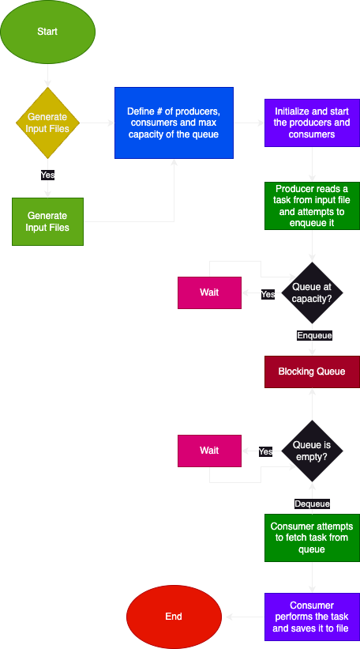

# 1. Overview

Author: [Zeyaam Shahid](https://github.com/zeyaam)

In the context of system design, we are often faced with composing inputs and outputs of tasks of varying complexities. When throughput of a task is meaningfully less than that of a succeeding task, we can decouple the tasks and run them asynchronously. We can use a PubSub (publish/subscribe) architecture for this purpose. We redefine our tasks as producers and consumers and use a queue to store the output of producers to be consumed by consumers. 

However, variations in the throughput of a task can cause the task queue to grow dramatically beyond memory capacity causing failure across the system. So it's important to place and enforce a capacity constraint on the queue in a concurrent fashion.

This application aims to showcase a simple implementation of a thread safe blocking queue in a multi-threaded PubSub setup. The blocking queue is generic and can be used to hold a variety of tasks. The number of producers and consumers can be adjusted to simulate different scenarios to validate functionality.

## 1.1 Examples

### 1.1.1 Dependency Graph Validator

The application has functionality to generate valid dependency graphs (in the form of binary trees) as well as connected/disconncted and cyclic/acyclic graphs. These graphs are saved in `graphs.txt` file in the `input` folder.

The consumer checks each graph for a cycle using BFS (Breadth-First Search) and checks to see if it is connected using the `UnionFind` data structure. If a graph is connected and acyclic, we know that a topological sort on the its adjacency list would yield a valid dependency list. So we save these graphs in the `dependency_graphs.txt` file in the `output` folder.

### 1.1.2 Closest Coordinate Calculator

Random 2-D coordinates are generated and stored in the `coordinates.txt` in the `input` folder. 

The consumer reads the file and compares a single coordinate to 100 other coordinates for the minimum euclidean distance between them. It then stores this output in the `closest_coords.txt` file in the `output` folder.

## 1.2 Process Flow

_Note: The process flow diagram is identical for both examples._

# 2. Implementation Details

The organization of the project is functional and descriptive. Here's a breakdown of the folder structure:
- `assets` contains the flowchart diagram above.
- `input`
- `output`
- `src/main/java/` contains the main file along with the core project files.
    - `DataStructures` contains the implementations of the thread-safe `BlockingQueue` based on a double `LinkedList`. `UnionFind` is included as well to enable validation of connectedness of a graph. `GraphUtils` contains all the utilities to generate and validate graphs.
    - `Model` includes task objects for the coordinates processing example.
    - `PubSub` includes producers and consumers for the aforementioned examples as well as the `PubSubController` class which is responsible for running the core functionality of the application.

## 2.1 Input Generation

The generation of the input data for the coordinates example is straightforward. We randomly generate 101 pairs of doubles for a single input and store it in the `coordinates.txt` file.

For the graph example, we randomly choose to generate one of the following graphs:
- A valid dependency graph in the form of a binary tree.
- An acyclic graph which may or may not be connected.
- A cyclic graph which may or may not be connected.

We then write these graphs as adjacency lists to `graphs.txt`.

## 2.2 Blocking Queue

The blocking queue is implemented using a doubly linked list and uses `synchronized` methods to ensure only one thread can execute it at a time to achieve mutual exclusion and prevent concurrent access to resources. To ensure the blocking functionality, we check to see if the queue is at capacity in the `addToQueue` method and to see if the queue is empty in the `removeFromQueue` method to ensure that the capacity of the queue does not exceed the capacity bounds. If the capacity is at the bounds, we use the `wait` method to apply back pressure to the producer or consumer to allow the constrained resources to become available again.

We use inter-thread communication methods `notify` and `notifyAll` to signal to the awaiting producers/consumers respectively to continue operating again after our queue constraints are satisfied.

## 2.3 PubSub Model

The publishers and consumers of both examples are extensions of the `Thread` object. This allows us to define virtual threads for concurrent production and consumption of our tasks. All producers and consumers take the same instance of the thread-safe blocking queue to operate on it concurrently.

The `PubSubController` consolidates the production of input data and execution of the examples in a single class for convenience.

# 3. Setup

- [Install Java on your machine.](https://www.java.com/en/download/help/download_options.html)
- [Install an IDE.](https://www.jetbrains.com/idea/download/?section=mac)
- [Clone this repo.]()
- Open the project in an IDE and run the `Main.java` file.

---
